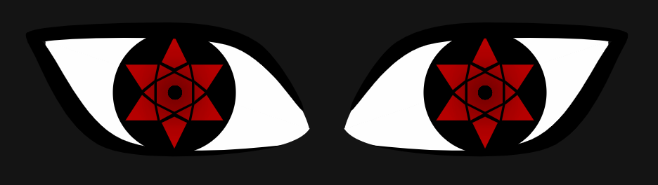

## **Mangekyou Sharingan Animation**

I've already written a few things last year and in preparation for the semester, so i wanted to do something different. I decided to do a drawing, mainly because i wanted to see how difficult it'd be to create something somewhat intricate. I'm really bad at drawing, and have neither the time, motivation or talent to cultivate this skill, so i wanted employ code to facilitate artistic expression. 
   
<figure>

</figure>

The program depicts an homage, or rather an attempted recreation of Sasuke's "Sharingan" from the anime Naruto. The output is made up of several components. The constitution of the drawing starts from inside out, at least my writing did. It started with the innermost ellipse, then the red shapes in the pupil, then the big ellipse, then the 'whites' in the eyes (with a line for correction due to inconsistency when using multiple begin/endShape()), then the black outline of the eye, and lastly the make-shift eyelids, which consist of two rectangles with the fill as background. 
   
Practically, the different elements are not called in this order. The pupil is called before the outline, so it appears "behind" the outline. This concept was somewhat hard to grasp, drawing from previous photoshop experience enabled this solution. 
   
The syntax scale(-1, 1) was especially useful. It functionally flips a "selection" horizontally. I'm sure it works vertically as well. I've stored most of my code in functions, where i included the scale arguments as parameters in the mangekyoSharingan function. My goal was really to have as much of my code in functions as possible. It's still quite long (450~) lines, and with a better understanding of OOP, I'm sure it could've been done in approx 200 lines. scale() was used in tandem with translate(), which is another syntax used for transformation. This was also very helpful, i had initially "duplicated" the pupil by changing the numbers, which the various shapes were based on. I made this easier by making them parameters in the function, so i could just call the function twice with different arguments. I ended up using the translate() method instead, since the curveVertex() used to create the eye shape were a little more different to manipulate. I could imagine using translate() in this manner would be considered bad practice. Honestly, the push() and pop() look pretty ugly in the code, and i can't grasp how you'd rotate an element this way. translate() effectively changes what the element considers as (0, 0).  translate(600, 0) then makes the shape consider (600, 0) as the starting point of the canvas. I think. They also "stack" additively, so if you call translate(50, 0) after the first call, the starting point would be (650, 0). This concept of multiple callings of translate has been used in the shaking animation. 
   
I'm somewhat satisfied with the result; there's a lot of optimizations to be done in the code, aswell as the animation, but after 4-5 days immersion i was getting pretty bored with it. The premise for calling of the animation is pretty janky:
   
The animations oocur based on the positions of the "eyelid" rectangles and the duration of the audioclip. The inherent mousePressed() function in p5 only calls a function once, and the rectangles move by adding the rectSpeed variable - this needs to happen continiously, due to the frameRate(1) function i've called. This was done to make the animation more "dramatic". The frameRate changes based on a conditional statement, which checks the position of the eyelid rectangles as well. I circumvented this mousePressed() issue with assigning a valuable to it. clickListener changes to -1 if mouse has been clicked, and if clickListener is -1, then the rectangles move. It checks if the audioTime has exceeded the total length of the clip, and the animations thusly stop when the audio clip is over, and the rectangles move back. I've constrained a few values, such as the rectangles and the blur, in preparation for allowing multiple animations, but the clickListener method is only valid once. 
   
Creating this somewhat geometric / triogonometric made me realize how bad i am at math, and a lot of time was just spent trying to grasp basic concepts of trigonometry, angles and coordinate points. The triangles on the diagonal(?) sides of the hexagon are not completely mathematically accurate, which is a bit of a shame. Also i have decided that angles shall henceforth be my mortal enemy. curveVertex() could make a grown person cry. 
   
In this RunMe, programming was used as a tool for artistic expression, or atleast recreation of this. However, it also employs concepts that i personally didn't associate with drawing before writing this. This project was naturally a little extensive, and I'm sure I could've at least made the shapes themselves in Photoshop a lot faster, but using code to achieve this was interesting, and has given me a better perspective and understanding of a lot of syntax, that i hadn't used before. Personally, i believe that the best way of learning how to code, for me atleast, is picking a lofty goal, and then just building it step by step. Then you might found out 'oh this doesn't work with this' and then you learn a lot faster. 
   
Reading other people's code has made me realize that there are obviously a lot of different ways in programming to achieve the same result, and seeing how other people interpret and solve problems can be beneficial to your own skills. 

### **References**
