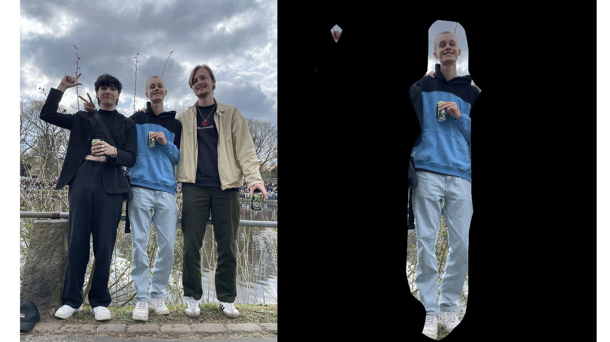
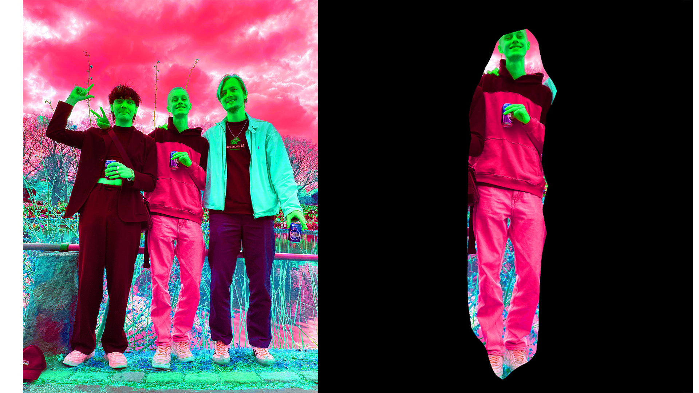
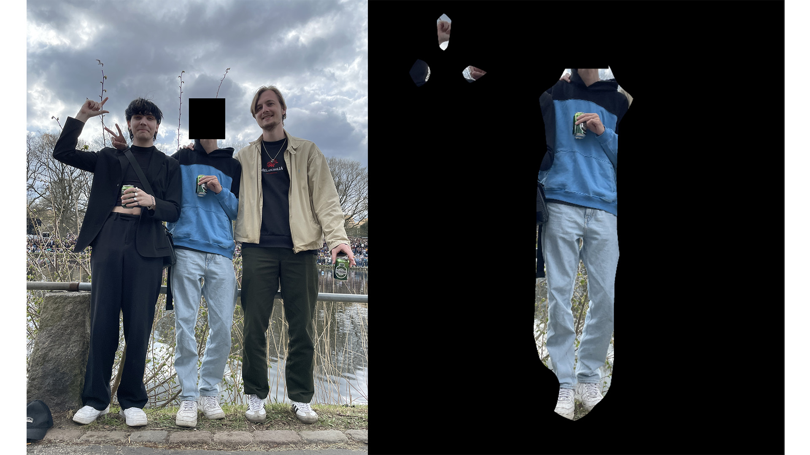
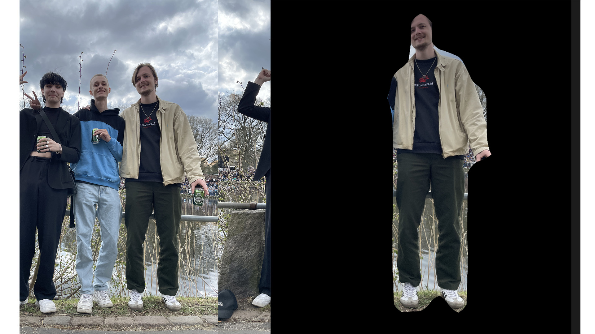
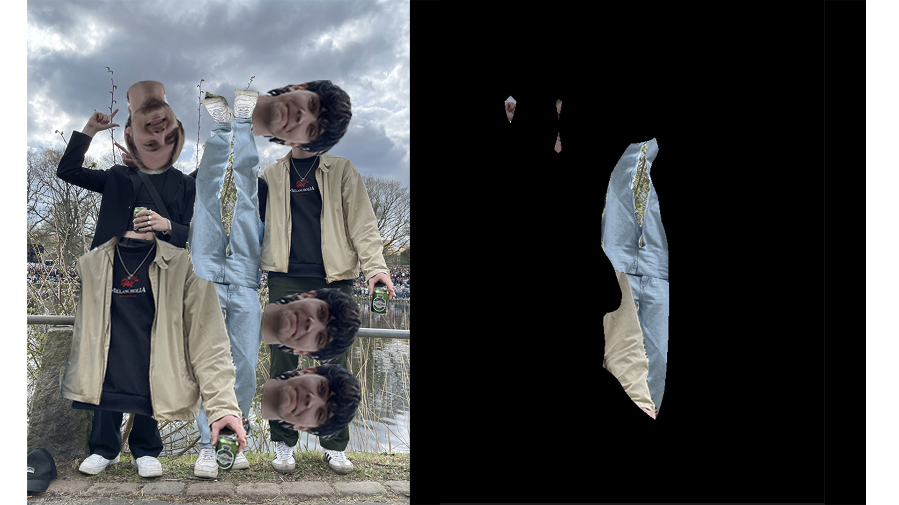

## BodyPix

# Which sample code have you chosen and why?

We’ve chosen BodyPix, primarily due to its seeming simplicity. Since our experience with machine learning is at best, shallow, we wanted to choose something “easy” so we could better understand the effects of our tinkering etc. In summation, our approach throughout our work with machine learning was to reduce variables, in order to ensure a better understanding / facilitate a better learning process. 

# Have you changed anything in order to understand the program? If yes, what are they?

The program accurately conveys the model of input - algorithmic process - output that machine learning is intended to produce. The primary form of tinkering in BodyPix would be to change the input. We changed the input and analyzed the output, with the intent of crystallizing the algorithmic processes in play. The idea was to make test pictures, which consist of the same picture with different boxes that block different parts of the image, to see how the algorithm performs under different circumstances.

We’ll preface our findings by stating the obvious: Our sample size is extremely small, and thus we won’t be presenting any conclusive findings, rather mere speculations and observations based on our small-scale experiment.

The most obvious conclusion we can draw based on our experiments, is that the program cannot handle more than one person. The program seems to prioritize the center of the screen as seen in the second to last picture, where we moved the middle of the picture, where it earlier prioritized the middle it did so again, so we speculate that the center of the screen is prioritized in the algorithm. We also found out the algorithm treats colour differently, in one of our sample pictures we changed the hue and saturation of the picture, which resulted in the algorithm perceiving the picture differently than the source and did a different cut. We think this is due to the colour configuration of the algorithm.

# Which line(s) of code is particularly interesting to your group, and why?

The sample code we chose is largely based on the assets used. The code itself is only about 25 lines, so it’s quite interesting that you can operate it with such few functions. We took a peak at the source code itself, and it’s absolutely massive. A very clear example of abstraction. We presume that it’s also due to the fact that the functionality of this application of the sample code is very one-note. 

# How would you explore/exploit the limitation of the sample code/machine learning algorithms?

It's often interesting to look at what the code can’t do, rather than what it can. As we mentioned earlier, we tried to manipulate the images used, partly to ascertain certain aspects of the algorithm, and partly to test the algorithm’s efficiency. 

# What are the syntaxes/functions that you don't know before? What are they and what have your learnt?

The functions are all arbitrary, and the source code is too complex to read. We learned a bit about callbacks / js promises. 

# How do you see a border relation between the code that you are tinker with and the machine learning applications in the world (e.g creative AI/ voice assistances/driving cars, bot assistants, facial/object recognition, etc)?

We initially collectively reflected on the nature of the program, trying to ascertain the intent behind the program’s creation. Due to the visual aspects, and terminology such as ‘mask’ we initially surmised it was purely for removing the background from images containing persons. After contemplating further however, we realized that if we viewed it as a “body detection” program, its use could be substantially different from simply removing a background. 

A program of this nature could even be used maliciously. Oftentime it’s hard to view the program beyond its simplest and clearest function, and truly contextualize it in the context of the real world. The algorithms in BodyPix might very well have merit within self-driving cars or other prominent fields of AI. This sentiment of compartmentalization of multiple aspects of AI is seemingly mirrored not only in BodyPix. Whether this is just par for the course or willful obfuscation is up for debate.  

As per the “getting started” section of their documentation, it segments an image into “person” and “background”, so it’s interesting to imagine an algorithm dictating whether you’re a person or not. 

We generally think algorithms have a serious risk of getting results which are unintended. As we demonstrate by tinkering with the input, the algorithm has a difficult time processing these images in a satisfying manner. If we think of algorithms that possess great power in society these unwanted results could have negative societal consequences.

# What do you want to know more/ What questions can you ask further?

As we’ve mentioned previously, it’d be interesting to truly explore the capabilities and limits of the program in other contexts than just the easily-indigestible masking of image backgrounds. We’d also like to know how the model was created, i.e. which training method was used, and what the intent behind it was. We think it’s important to question the intent, especially because of the ressource expended in training these models. Since it’s in the ml5 library, we surmise it might be for educational purposes. 
