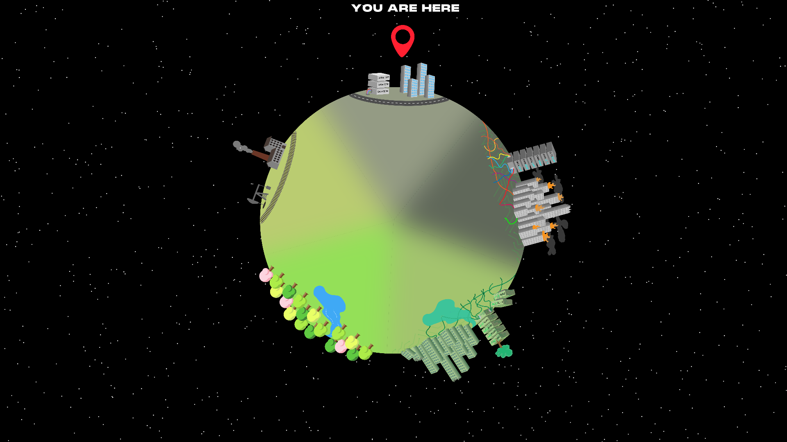

<h2 align="center"> The Wheel of Time</h2>

**INTRODUCTION** <br>
The Wheel of Time is intended as an abstraction of our perceived material reality. A world in which the flow of time is cyclical. A dystopian imaginary depicting a world doomed to continuously destroy and rebuild itself, both processes facilitated by the hands of human greed. An inescapable infinite loop perpetuated and sustained by its cyclical nature of human evolution. This infinite loop is further represented in our source code. Just as our abstracted world is fatalistically fated to doom itself, as is the machine fated to infinitely perpetuate the turning of the wheel of time.



The program itself is largely experience-based. Although the individual is presented with the choice to turn the wheel, the outcome is deterministic; You can’t turn back time. By utilizing the illusion of choice, we’ve touched upon notions of fake agency. We did so in order to highlight the helplessness of the single individual when staring down the inevitable passing of time. Instead redirecting the individual’s reflection towards attainable topics pertaining to our perceived reality, such as demanding accountability and -to some extent- individualistic sustainability. The individual is taken through a historical rendition of monumental eras in the abstracted world’s past. Although the eras visited specifically pertain to the abstract world, and thus the experience is enclosed within its confines, it’s largely abstracted from our perceived reality. Whilst real history of our world is included, we’ve also included speculative conjecture in the latter stages. The experience is partially intended as an imaginary future, intended to raise questions and spur reflections surrounding key topics such as consumerism, environmentalism, temporality, and technological advancements contradicting nature. Thus, there’s an undeniable linkage to our collective reality present in our program. The experience is accompanied by an all-knowing narrator. The narration is segmented, thereby providing accompanying voice lines to each era. The narrator itself is a large part in creating an immersive experience. We’ve outsourced the voice acting itself, and then edited them to fit our vision that we conceptualized through our initial ideation. We’ve attempted to portray the narrator as archaic, all-knowing, condescending and divine, generally removed from the mortal experience of temporality.

As previously mentioned, we’ve attempted to create an abstracted world, with the intent of critiquing and questioning status quo and incorporeal concepts such as temporality. We believe this practice to be essential to- and pertaining specifically to the field of aesthetic programming. This sentiment is mirrored in the following quote: 
>*“Aesthetic programming in this sense is considered as a practice to build things, and make worlds, but also produce immanent critique drawing upon computer science, art, and cultural theory.”* <br> (Soon & Cox, 2020, p. 15).

In both conceptualizing and coding our program, we’ve attempted to reflect upon the practice of aesthetic programming. Aesthetic programming itself will inevitably be tightly interwoven in both processes, as it has largely shaped our way of approaching and discussing key topics within the field. Furthermore, aesthetic programming has, at least in part, been our introduction to the world of coding, and has thus shaped how we approach concretizing our abstract vision.

**TEMPORALITY** <br>
In The Wheel of Time, we present five distinct time periods, where some are yet to happen, only being an imaginary dystopian future constructed in our narrative. We then relate each of these time periods to their technological achievements. By doing this, we create a connection between the human idea of temporality, which is largely connected to the actual passing of time and measurable cycles to our relationships with technology.

In relation to infinite loops, the intended message of the program revolves around the idea of time as an infinitely cyclical event. The actual ‘experience’ of the program does end at some point (when the individual can no longer press the arrows to advance the time portrayed), but the world will keep spinning indefinitely, which means the individual itself will have to determine when the program is ‘over’. This can raise some comparisons between the perception of time between humans and machines, using Wolfgang Ernst’s idea of having a ‘sense of ending’ which was presented in ‘… Else Loop Forever: The Untimeliness of Media.’ (Ernst, 2009). In this way, one could relate the human ‘sense of ending’ to when we see it best fit to end an experience, as opposed to when the machine would determine an experience to be ‘over’.

The concept of a cyclical time in itself is not regarded as something new and unprecedented, it has been a prominent concept throughout time, as witnessed in ancient greek images displaying the ouroboros, a serpent eating its own tail symbolizing the cycle of life and death. (Soon & Cox, 2020, p. 73). The concept of cyclical time also ties into the previously mentioned notions of infinite loops, since cyclical time in itself is an infinite loop. Because of this distinguished concept of cyclical time, we concatenate our lives and time to fit such a cycle, as seen in the symbolization of the cycle of life and death.

Not only do we have the ouroboros as a means of relating to time, we have many other ways in which we relate to and experience time which we’ve developed and revised over time, as written in this quote: 
>“Humans have also developed ways to relate to time on longer scales, which were originally linked to natural rhythms: years, life cycles.” (Lammerant, 2018, p. 91). 

One instance of how we relate to time on a larger scale would be lunar calendars.
Lunar calendars are a way in which we get a sense of where we are in time and how time will continue into the future. This calendar is based on the natural rhythm of the moon and gives a way of measuring days, months, years etc. The lunar calendar is only one of multiple calendars, thus evidently expressing how we’ve developed multiple means of comprehending time. Different calendars developed under different millennia exhibit an ever-evolving experience of- and development of how we relate to time.

As previously mentioned, humans developed ways for measuring time around different natural cycles such as days, years and even life cycles. We wanted to explore alternative theories surrounding the perception of temporality, thereby focusing our idea around the concept of cyclical time. Rather than defining a ‘cycle’ as simply a year or a lifescale, we operate on an infinite planetary scale, taking the entire span of civilization as one iteration of the loop.

By digitizing the visualization of this cycle, we create a linkage between human- and machine temporality. Although one might not at first think of a computers idea of time as ‘natural’ in the same way as we consider a second or a year as a natural time measurement, it actually does have its own ‘natural cycle’:

>*“Machines also have their natural cycle: the vibrating pulses of the internal crystal clock drives the cycles according to which the processor works.”* (Lammerant, 2018, p. 91).

So even though machines do have their own inherent measurement of temporality, we translate it into something more understandable to ourselves. By doing this ‘translation’ to human temporality, it shows both a relationship between the two ‘ideas’ of temporality in the way of machine temporality still being a ‘natural cycle’ in the literal sense (vibrating pulse of the internal crystal clock), whilst still needing to be translated our perceived natural cycle that we have already deemed more ‘natural’ in our sense.

This idea of human temporality being developed and shaped in tandem with our technology is further highlighted here:
>*“Humans have developed a time experience which was linked to natural life cycles, but it has been influenced by both technology and social conditions.”* (Lammerant, 2018, p. 89).

Human temporality is thus shaped in return by machines, by using machines to measure our ‘natural cycles’. By translating machine temporality into something understandable by us, we further develop the relationship between the two ideas of temporality by using that very same technology to shape the rest of the society around us. Thereby utilizing technology to reinforce our own perceptions of time, has allowed humans to create a more refined, accepted  and shared sense of temporality across cultures. In this sense, we shape human culture and temporality after machines, and the ubiquitous nature of technology creates a sort of feedback loop where our own sense of temporality is becoming more and more centered around our cultural relationship with technology.

It’s evident that temporality has been a central theme in both our conceptualization and end-product. We’ve included theories on temporality, in order to sustain and explore several key topics specifically pertaining to temporality. Yet in including these temporal aspects in our design, we’ve also abstracted temporality itself in our abstracted world.

**OBJECT ABSTRACTION** <br>
Through our coding, we’ve attempted to instill a separate temporality in our program, partially by abstracting our own sense of temporality, drawing from historical contexts and from our vision surrounding a dystopian imaginary future. We opted for a general idea of events driving temporality in our program. This means that the individual is continually faced with choices, which are, in the end, illusory. It’s important to know that these options are provided through what we have coded, and efforts have been made towards distilling into the individual a sense of false agency and by extension, helplessness. Concrete examples include using lerpColor() to change the color of the sky, attempting to showcase how the environmental impact of humanity affects the atmosphere, effectively presenting changes in the environment to mimic the passing of time. We’ve also tried to connote technological evolution between the eras, thus trying to create continuity in how the eras are visualized. It also includes tracking whether the wheel is rotating with the boolean isRotating.

Although the turning of the wheel reflects the passing of time, the individual’s experience within the abstracted world is largely retrospective. The individual is experiencing the world’s temporality not through an inhabitant, but from the narrator’s perspective. An inhabitant living and dying within the industrial era would not experience temporality as cyclical, but rather as linear. We’ve paid a lot of attention to how the narrator was presented: We’ve abstracted our ideas of a transcendent being, removed from mortal temporality, both as a tool for framing the narrative, and for furthering the intensity of the experience. Thus, calling it a recounting of the world’s temporality might be more accurate. This multi-layered abstraction of temporality, when coupled with one’s own sense of temporality in their perceived reality is intended to spark introspective reflections as well as reflections regarding the corporate entities sustaining the status quo.

Although we’ve delved into the conceptual abstractions of our world, our source code also includes other prominent aspects of Object Oriented Programming. Javascript is inherently an object-based language based on prototypes, but has multiple different ways of utilizing OOP. Although we haven’t focused on class-based OOP, we’ve used first-class objects (functions), and created image and button objects through the p5 DOM library (Mozilla, 2022).

```javascript
let valCheck;
let soundIsPlaying = false;
let eraArray = [false, false, false, false, false, false, false, false];
// EraArray is used to store whether a sound is played or not
// The placement in the array correspond to different eras.

function soundCheck(sound) {
  valCheck = sound.isPlaying()
  if (valCheck) {
    return true
  }
}

function playSound(target, sound, arraynum) {
  if (stateTracker === target && !isRotating && !soundCheck(sound) && !eraArray[arraynum]) {
    sound.play();
    soundIsPlaying = !soundIsPlaying;
    setTimeout(soundFlip, sound.duration()*1000);
    eraArray[arraynum] = true;
  }
}

function soundFlip() {
  soundIsPlaying = !soundIsPlaying;
}
```

In our program, we’ve heavily utilized the p5 sound library. In our preload() function, we instantiate several sound objects through the class inherent to p5 sound, functionally accessed by the loadSound() syntax. We’ve based several timings on the properties of our sound objects, an example could be the function buttonChange where we get the sound’s property of duration through voiceIntroduction.duration(), in order for the program to check whether sound is playing, flipping the boolean through calling soundFlip() in setTimeout() based on the duration of the sound. Beyond the properties, we’ve used inherent methods such as play() and stop().

We’ve created our own method playSound() to handle how the sound-objects are played. The intent is to ensure that appropriate sounds are only played once, that the sound-objects are played at the right time and that no overlapping voice lines occur. Our function is largely based on the inherent p5.sound methods, creating an overall method that can be called for each voiceline. We feel this reflects the polymorphism aspect of OOP, since the single method is able to be successfully applied to each sound object. We wrote the method with this aspect in mind, intending to create a method applicable across multiple objects. You might also argue that the inheritance aspect is present, since we utilize previously defined methods.

We initially had problems creating playSound(), because we used separate variables instead of an array, but using variables meant that rather than referring to the variable, the value was passed through as the argument. We could’ve potentially circumvented this by using the arguments object, instead we made sort of a pseudo-arguments object, namely the array containing whether each sound has been played (Mozilla, 2022). This meant that we could refer to a specific variable in the array and thereby determine whether the corresponding sound-object has been played.

By abstracting our perceived reality in our conceptualization, coding and visualization we’ve effectively chosen which things and concepts to abstract, that inevitably generates a remainder; things we’ve left out. This notion is reflected in the following quote:
>*“Object abstraction in computing is about representation. Certain attributes and relations are abstracted from the real world, whilst simultaneously leaving details and contexts out.”* (Soon & Cox, 2020, p. 146).

By using this quote, we hope to further illustrate how abstracting our perceived reality will never be an unbiased practice. The nature of our abstractions are largely a reflection of ourselves, since our bias is inevitably grounded in our perception of the world. However, these notions also help us articulate the relevance of the practice of aesthetic programming. It helps us recognize that our tailored narrative specifically pertains to us, meaning that the program will inherently be biased. Thus arguing that aesthetic programming provides us more than simply the ability to create a functioning program, also helping us remain critical in our practice, recognizing our bias, exploring the cultural ramifications of coding, and using aesthetics to articulate our vision.

Our purpose of abstraction is, essentially, an effort to impact our material reality. The interconnectivity of abstraction and reality are highlighted in the following quote:
>“Computation not only abstracts from the world in order to model and represent it; through such abstractions, it also partakes in it.” (Fazi & Fuller, 2016, as cited in Soon & Cox, 2020, p. 145).
> 
Rather than simply recognizing that our abstractions inevitably partake in reality, we’ve chosen this very notion as a core aspect of our program’s purpose. The experience we present is only fully realized in-tandem with the observing individual. Therefore, the program presents itself dramatically. It relies on its ability to inspire emotion within the observer, in order to obtain the mantle of a ‘critical work’. A critical work intended to partake in- and influence the contemporary discourse surrounding climate change and silicon valley-esque techno-utopianism.

**CONCLUSIVE REFLECTIONS** <br>
Interaction was at the forefront during our initial conceptualization of our vision. However, we had difficulties realizing our initial plans for interaction, which included having the individual directly turning the wheel with the mouse. We initially thought interactivity was the crux of the argument for the program being written in code, but through the programming itself and continual conversations and reflections amongst ourselves, we came to appreciate how the technical aspect supplied the envisioned narrative surrounding our core themes. As well as how the technological perspective contributed to a continual evolution of our concept.

An integral part of our program is timing events correctly. These timings have to be concise and cohesive. Throughout our program, we use a variety of different methods of employing temporality: Sound duration, the rotation of the wheel based on frames, and scale of wheel. The temporality in our program is quite convoluted, which says something in itself. There’s a high degree of interdependency between differing elements of our code. We’ve used frames multiple times in our calculations. The concept of frames largely operates within the scope of human temporality being translated into machine temporality; Evidenced by its essentiality within the p5 programming language. We’ve also implemented the concept of keyframes in our CSS animations: The arrow hover effect essentially reverts to its previous state when the hover event is no longer triggered. Thus, large parts of our program consists of an attempted joining of human- and machine temporality;  Facilitating communication between human and machine.

>*“We might go as far as to say that programming allows for a time-critical understanding of how technologies play a crucial role in our experience of time, not only how we model it, but how we can forge new beginnings and endings.”*   (Soon & Cox, 2020, p. 93).

This quote further highlights our previous points. The crux of the matter is, we want the machine to execute certain actions, at certain given timings. In order to successfully accomplish this the machine needs to understand our commands, and we need to understand how to articulate these commands. This happens within the confines of programming languages. The code itself effectively becoming the medium of communication between us and the machine.

In finalizing the aesthetics of the program we’ve utilized a variety of different tools. We’ve used different technical workspaces such as Illustrator, Photoshop and Audacity, as well as references from past- and contemporary culture, but at the forefront of it all is the programming itself. Programming is the lynchpin that turns a folder of assets into an immersive experience. We feel that the lens of aesthetic programming has provided a bridge between aesthetics and technology, thereby enabling us to further explore the aesthetics of our vision through the technological conception of our program.

### REFERENCE LIST:
---
Ernst, W. (2009). “… Else Loop Forever”. The Untimeliness of Media. <br>
https://www.musikundmedien.hu-berlin.de/de/medienwissenschaft/medientheorien/ernst-in-english/pdfs/medzeit-urbin-eng-ready.pdf 

​​Lammerant, H. (2018). How humans and machines negotiate experience of time. In Wing, C., Morandi, M., Pierrot, P., Burato, A., Haag, C., Murtaugh, M., … Gürses, S. (Eds.), The Techno-Galactic Guide to Software Observation, (pp. 88-98). Brussels: Constant vzw.

Soon, W. & Cox, G. (2020). Aesthetic Programming: A Handbook of Software Studies. London: Open Humanities Press.

Mozilla. (2022, May 5) Functions - Javascript. Retrieved May 15 2022 <br>
https://developer.mozilla.org/en-US/docs/Web/JavaScript/Reference/Functions 

### APPENDIX:
---

Link to final project’s RunMe:
https://9plus10savage.gitlab.io/aesthetic-programming/miniX11/

Link to final project's code repository: https://gitlab.com/9plus10savage/aesthetic-programming/-/blob/main/miniX11/

Albin’s GitLab:
https://gitlab.com/Albinooo/AestheticProgramming/

Gabriel’s GitLab:
https://gitlab.com/9plus10savage/aesthetic-programming 

Lissa’s GitLab:
https://gitlab.com/UNBLISSFUL/aesthetic-programming 

Victor’s GitLab:
https://gitlab.com/VRAS/aestheticprogramming

---

### FLOWCHART:

