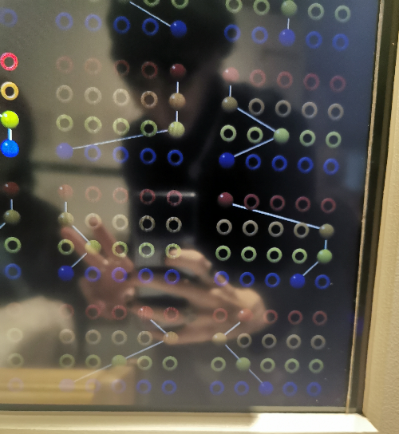
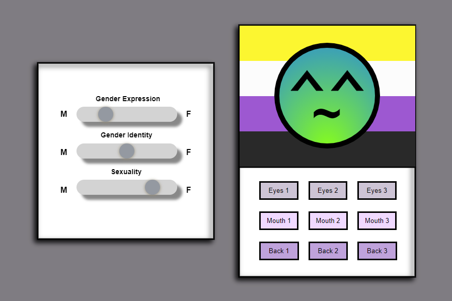

## Personalized Gender Emoji
My concept/vision was based on an exhibit at KØN museum in Aarhus called Gender Blender. A part of this exhibit was this artifact, where you'd input your biological sex, gender identity, gender expression, and your sexuality. You had 4 sliders with 5 different points, after inputting these, you could submit them, and you could see other people's results as well. The results are depicted in the image below:    

   
I will preface my design by stating that there's several issues with this representation of gender and sexuality as well. Firstly, although to a lesser extent that the unfortunately "commonplace" depiction of the gender spectrum, this version is still quite binary. Secondly, including sexuality with no alternative, will exclude individuals who don't experience sexual/romantic attraction, or who don't allign with any sexuality. 
   
Rather than having 5 fixed points, i decided to make sliders appear completely without any "stopping points", representing the fluidity of gender. I decided to exclude biological sex, since i did not see any merit in it's inclusion. 
   
The 3 sliders decide the gradient of the circle, and the 9 buttons provide some basic customization through geometric shapes. 
   
The generated emoji is intended as a way of expressing your gender through your own personal emoji. My vision initially included a caricature of a cutesy corporate ai, disguising data gathering as personal expression, commenting on capitalist exploitation of queerness and the want for individualism in modern online society. 
   
Quick note on the code itself: I wanted to try manipulating the DOM through the inherent functions in the js library, so the sliders and buttons are styled through CSS in the style.css file. The click detection is quite disgusting, needing 9 different functions to operate properly. I wanted to try fixing this through the syntax in the first link, but i kinda ran out of time. 
   

   
Please view the program [here](https://9plus10savage.gitlab.io/aesthetic-programming/miniX2)  
You can check out the full repository [here](https://gitlab.com/9plus10savage/aesthetic-programming/-/blob/main/miniX2/sketch.js)  
You can check the CSS styling [here](https://gitlab.com/9plus10savage/aesthetic-programming/-/blob/main/miniX2/style.css)

### **References**
[Passing arguments in mousePressed()](https://stackoverflow.com/questions/35680778/p5js-button-mousepressed-calls-function-arguments)
 
[Gender terms](https://myhealth.alberta.ca/Alberta/Pages/gender-ID-expression-LGBTQ.aspx)
 
[Gradient tutorial](https://www.youtube.com/watch?v=-MUOweQ6wac)
 
[HTML / CSS slider styling](https://www.w3schools.com/howto/howto_js_rangeslider.asp)

