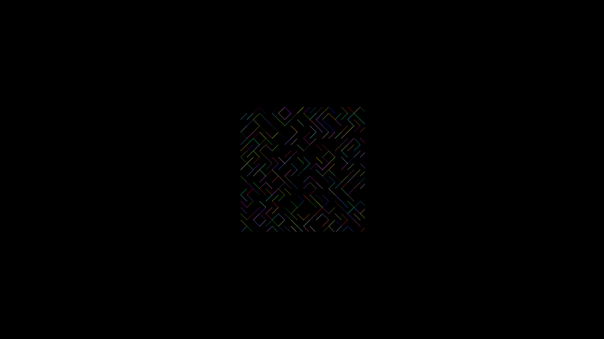

## 10 Print Variations

You can run the program [here](https://9plus10savage.gitlab.io/aesthetic-programming/miniX5)

You can view the code [here](https://gitlab.com/9plus10savage/aesthetic-programming/-/blob/main/miniX5/sketch.js)

The basis of my miniX is a variation of 10 print, attempted to be made more "modern" OOP. The rules are the same as the original 10 print, but with variations after completion of the drawing. Therefore the rules are quite simple. Start with a basic 10 print sketch, and then, without removing or adding objects, create some sort of change through manipulating the objects. 

It starts by printing the sketch, as the original might. All the lines are seperate objects, where the random() function decides whether to display it as a backward- or forwards slash based on which array the object is pushed into. I sought to combine the arrays through a couple of different ways, perhaps a 2D array could've worked, none of the inherent pure js methods seemed to work.

After it's finished printing the initial sketch, the program has 4 different variations. They're picked at random using the same method, using a for loop to iterate through the array, calling the method for each separate object in both arrays. 

There's somewhat an emphasis on temporality in the program; You can divide it into 2 distinct stages, whereby the first is the basis for the second. The second being the varying states, which refresh every 180 frames. 

The autonomy is largely with the creator, who can easily create various methods for the objects. I'd say the end result would be the interesting part. The code is pretty basic and quite deterministic. I would've liked to have added more randomness through more methods, in theory you could infinitely add methods to the object, presuming the objects intrinsic qualities allow for the state to "reset" after it's not being called anymore.

I think generative art as a theme is an interesting subject, especially due to the complexity of the very existence of the art style. Phillip Galanter explores said intricacies in his text "Generative Art Theory", explaining the immense variance in each artist's own definition of generative art. He provides an overall definition, which he touts as the most widely sited definition (at the time) of generative art:

*"Generative art refers to any art practice in which the artist uses a system, such as a set of natural language rules, a computer program, a machine, or other procedural invention, that is set into motion with some degree of autonomy, thereby contributing to or resulting in a completed work of art. (Galanter 2003)"*

He explores the surprisingly complex history of generative art. I generally associated the rise in popularity with the advent of affordable powerful home-computers, but it seemingly has a rich history of application across various cultures. 

Although Galanter has provided an extensive account of various topics, themes, and methods within generative art, the very nature of the art style, necessitates a need for a broad definition, since the basic premise is so simple, it can be taken in so many differing directions. 

Whether it can be used solely for production of assets, textures, animation etc. or it can truly "compete" with traditional art is an open question. Possibly unable to be answered by anyone but oneself. Even in traditional art, every one has subjective taste, although the elite attempts to dictate these. I imagine the field will only keep evolving, and imagining where it'll be in 10 years seems impossible to me.

## References

Philip Galanter, “Generative Art Theory,” in Christiane Paul, ed., A Companion to Digital Art (Oxford: Blackwell, 2016),
