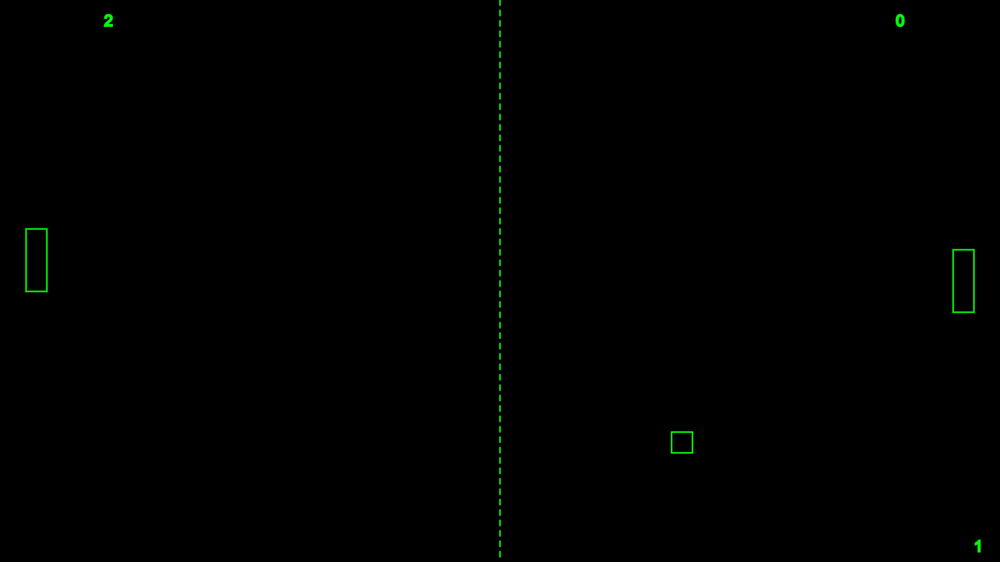

## Pong in p5.js

You can run the program [here](https://9plus10savage.gitlab.io/aesthetic-programming/miniX6)

You can view the code [here](https://gitlab.com/9plus10savage/aesthetic-programming/-/blob/main/miniX6/sketch.js)

### Describe how your game and game objects work

This program is a rendition of the classic game 'Pong'. The program is comprised of 3 different classes, each with just 1 iteration, except the player characters. Obviously these objects need to communicate, and i had some troubles regarding where to put certain properties. I couldn't figure out if the object classes could interact with eachother directly in the class definitions, conceptually it didn't make sense to me, so i did the collision detection and collision response in a function.  

### Describe how you program the objects and their related attributes, and the methods in your game

The player object iterations contain similiar properties, with only the position and keycodes used for movement being heterogeneous. They have the same intrinsic properties, but with different parameters.  Since objects seemingly don't allow hoisting, I had to pay attention to the order of the properties, as well as groupings of these properties, this was mainly for good practice though. The methods of the object classes and instances are all inter-connected, and communication through these instances are integral to the program. Considering the concept of encapsulation within OOP, these classes are enclosed in their own "block". The use of the 'this' prefix largely embodies this. I could have an individual x value for both the Player and Ball classes, without any conflicts, since they're specific to that specific class, and simply refer to the instances simply refer to these values. I considered using inheritance in creation of the player class, since they slightly differed, but obviously this method was more efficient. There's some similarities between the Ball and Player classes, like the fill/stroke, these could potentially have been inherited from a parent class. I can't see a practical use for polymorphism, when the classes are this simple/different: method overloading the show method might be my best example of dynamic polymorphism. 

Abstraction is obviously present in the properties of the classes that i've chosen to include, as well as the concrete visual representation of the instances. An example could be the property rectXStart in the Player class. This variable is used for storing the initial position of the Players, so the players can return to their initial position after a point is scored. Seemingly there's no need for this variable, since it simply concerns the position of the player, which correlates to rectX, but since this variable is continiously manipulated through the move and boundsDetection methods, there's a need to store the initial variables passed through the object instantiation. 

### Connect your game project to a wider cultural context, and think of an example to describe how complex details and operations are being "abstracted"

Pong can be considered as one of the earliest video games, and thus it has an important place in the history of video games, and in extension computer graphics. It also serves as an example of abstraction of table tennis, which Pong is based on.  There's a reason why it's been reimagined so many times, for so many different systems. It's also an interesting example of a simple two-player game. Pong has since evolved to a point, where you can "play vs. the computer", and thinking about how one might make a 'fair' instance of AI, that the player might play against. Seemingly, it'd be easy to make a modern computer calculate the trajectory of the ball, and move the paddle accordingly, but figuring out how you'd make a "beatable" computer is far more interesting. 

The collision detection and collision response seems simple in practice, although it's actually a bit complicated. It's abstracted as though the velocity of the ball is reversed, due to the impact of the paddle, although the speed is just multiplied by -1. I really dislike the dist() function, the performance is way too slow, so the (crude) method I've used checks all four sides of the rectangle. Specifically, it checks whether the ball will be inside any given side of the rectangle. Although, it's not perfect by any means, the result is passable. Since it's unit collision between two moving objects, it's a bit tricky.  Being able to reliably calculate the trajectory of movement would be interesting. 

## References

* Soon Winnie & Cox, Geoff, "Object abstraction", Aesthetic Programming: A Handbook of Software Studies, London: Open Humanities Press, 2020, pp. 143-164
* [Collision detection by happycoding](https://happycoding.io/tutorials/processing/collision-detection)
* [Four pillars of OOP](https://www.youtube.com/watch?v=pTB0EiLXUC8)
