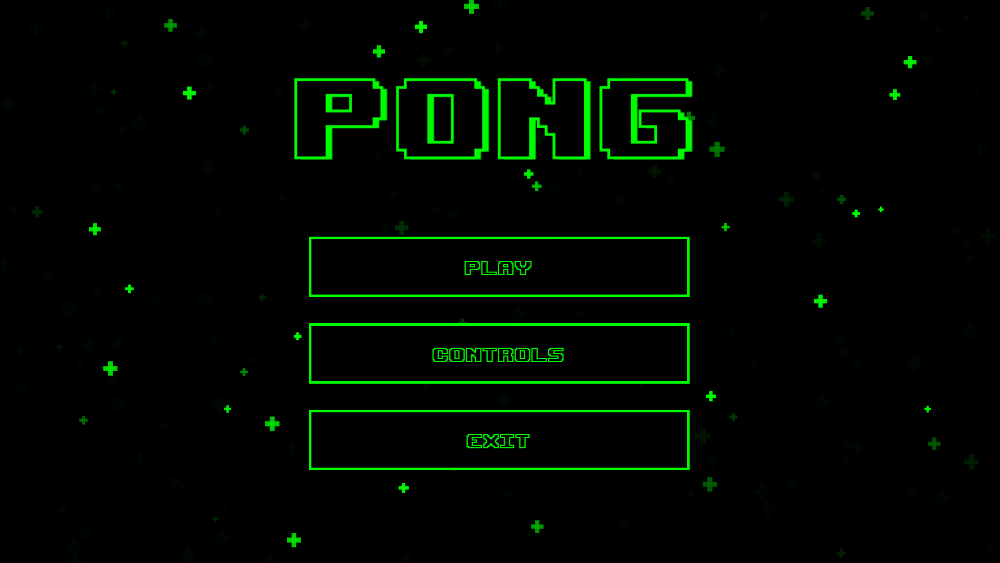

## Final version of Pong

You can run the program [here](https://9plus10savage.gitlab.io/aesthetic-programming/miniX7)

You can view the code [here](https://gitlab.com/9plus10savage/aesthetic-programming/-/blob/main/miniX7/)

### Which miniX have you reworked?

I've chosen to rework my miniX6, partially because my mind was still kinda stuck on it, but mostly because before the semester started, my friend Victor and i tried making pong in p5. My miniX6 largely consisted of optimizing the code, and rewriting it to more accurately reflect OOP. I really wanted to polish it, whilst adding more improvements, in order to have a "final" product, that i can compare to the initial program that we created, sort of a benchmark for my personal progress. It's definitely made me reflect on my experience with technology, and how I've improved during these past few months. 

### What have you changed and why? 

The biggest change is obviously the addition of another page, namely the start screen. The main purpose behind this change, was to use more HTML, CSS and pure JS, which is how i initially started learning coding in the previous semester. I've used some code that i used in an earlier project, and seeing how much my understanding has improved was nice. I included the controls button/modal based on feedback that i received.  I've made some necessary additions to the core game as well. The timer/countdown  and the option to actually win a game are the most essential additions. I also added some feedback in the form of sounds. Other than that, most other changes are basic QoL changes, that contributes to the aforementioned polishing that I wanted to attain, in order to showcase my progress to myself. 

### What have you learnt in this mini X? How did you incorporate/advance/interprete the concepts in your ReadMe/RunMe (the relation to the assigned readings)?

A big theme in the ReadMe of my miniX6 was communication between different elements. I tried a lot of different ways of further focusing on this during the conceptualization of my miniX7. Some successful, some less. I struggled a lot with the collision detection, and I was unfortunately unable to improve it/make it a method. 

In this miniX i explored links between p5, the DOM, and pure javascript. I learned a lot about how I can translate my knowledge of p5 into understanding fundamental javascript syntax. There's also new examples of inheritance in the HTML code, with the divs and their child elements. 

Another reason for choosing to recreate pong was the exploration of early games, and in my miniX7 i further explored the concept of a game. My goal was to create a more playable game, which i almost achieved. The replay button was unfortunately scrapped due to time contraints. 

### What is the relation between aesthetic programming and digital culture? How does your work demonstrate the perspective of aesthetic programming (look at the Preface of the Aesthetic Programming book)?

Digital culture is an ever-changing entity in the current landscape of our digitial lives.  In my program, there's obviously a variety of properties being abstracted from the real world. The most prominent example being the abstraction of table tennis, from our perceived physical world, to the abstract world of computation. I find it hard to correlate my program to the practice of aesthetic programming. There's a reflection of computational culture in some of the ways I've abstracted certain things, such as the hover and active effects on the buttons. I think my previous mentions of my "coding journey" is also an example of how my progress within programming has manipulated my way of thinking about technology and digital culture. Through the technical aspects of aesthetic programming, coupled with the alternative humanistic approach presented in the practice of aesthetic programming, I've gained a small amount of competence within coding, and expanded my view of said coding, and it's impact on digital culture. I've learned that programming is not just a means of production, problem-solving or analytics, but also a way of engaging with the world, digital or not, around us. 

## References

*  Soon Winnie & Cox, Geoff, "Object abstraction", Aesthetic Programming: A Handbook of Software Studies, London: Open Humanities Press, 2020, pp. 143-164
*  Soon Winnie & Cox, Geoff, "Preface", Aesthetic Programming: A Handbook of Software Studies, London: Open Humanities Press, 2020, pp. 13-24
*  [Closing current tab using Javascript](https://stackoverflow.com/questions/2076299/how-to-close-current-tab-in-a-browser-window)
*  [Modal box documentation](https://github.com/webgadgets/ModalBox)
*  [Finish playing sound before url redirect](https://www.sitepoint.com/community/t/play-sound-on-hyperlink/42235/3)
*  [Floating CSS animation](https://codepen.io/MarioDesigns/pen/woJgeo)

